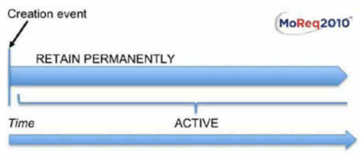
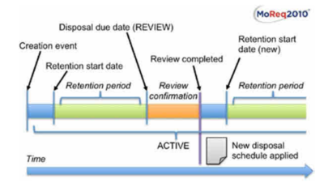
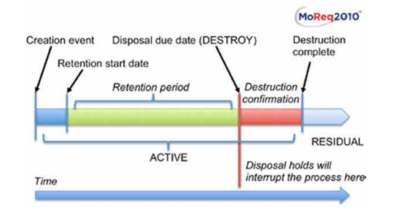

# Gallringspolicyer

## Gallringsschema

Gallringsscheman anger minimikraven för underhålls-, bevaring- eller destruktionsåtgärder som ska vidtas i befintliga eller framtida intellektuella enheter i detta förvar. En intellektuell enhet får endast förstöras som en del av en gallringsprocess som styrs av det gallringsschema som tilldelats den enheten. Det är den intellektuella enhetens gallringsschema som bestämmer hur länge en post bevaras och hur den därefter gallras i slutet av dess bevarandeperiod.

### 1. Vad är ett gallringsschema?

[MoReq2010®](https://moreq.info/) säger "Gallringsscheman är avgörande för att hantera bevarandeobjekt eftersom MoReq2010® specificerar att ett bevarandeobjekt i ett MCRS endast får förstöras som en del av en gallringsprocess som styrs av gallringsschemat som tilldelats till det bevarandeobjektet . Det är bevarandeobjektets gallringsschema som avgör hur länge ett bevarandeobjekt bevaras och hur den därefter gallras vid slutet av dess bevarandeperiod."

RODA stöder tre typer av gallringsåtgärder:

1. Behåll permanent;
2. Granska i slutet av bevarandeperioden;
3. Förstör i slutet av bevarandeperioden.

Beräkningen av bevarandeperiod använder sig av identifierare av element för bevaring och lägger till dess värde med bevarandeperioden. De möjliga värdena för bevarandeperiod är:

1. Ingen bevarandetid;
2. Dagar;
3. Veckor;
4. Månader;
5. År.

### 2. Vad kategoriserar ett gallringsschema?

Följande attribut kategoriserar ett gallringsschema:

| *Fält* | *Beskrivning* | *Obligatorisk* |
| --------- |---------- | ------------- |
| Titel | Det identifierande namnet eller titeln på gallringsschemat | Sant |
| Beskrivning | Beskrivning av gallringsschemat | Falskt |
| Mandat | Texthänvisning till ett rättsligt eller annat instrument som ger befogenhet för ett gallringsschema | Falskt |
| Omfattningsanteckningar | Vägledning till auktoriserade användare som anger hur man bäst tillämpar en viss enhet och anger eventuella organisatoriska policyer eller begränsningar för dess användning | Falskt |
| Gallringsåtgärd | Kod som beskriver den åtgärd som ska vidtas vid kassering av posten (möjliga värden: Behåll permanent, granska, förstör) | Sant |
| Identifierare av element för bevaring | Det beskrivande metadatafältet som används för att beräkna bevarandeperioden | Sant (om åtgärdskoden för gallring skiljer sig från Behåll permanent) |
| Bevarandeperiod | Antal dagar, veckor, månader eller år som specificerats för att bevara ett bevarandeobjekt efter att bevarandeperioden har triggats | Sant (om åtgärdskoden för gallring skiljer sig från Behåll permanent) |

### 3. Registrera livscykel

#### Livscykel för permanent bevarande

Denna typ av gallringsschema, utan trigger för bevaringsperiod, har effekten att förhindra beräkningen av ett startdatum för bevaring och en efterföljande bevarandeperiod.

#### Granska livscykel

När ett bevarandeobjekts gallringsåtgärd är inställd på granskning är den inte omedelbart föremål för förstörelse. Istället måste resultatet av granskningen innefatta tillämpning av ett gallringsschema på objektet baserat på granskningsbeslutet. Det nya gallringsschemat kommer att ersätta det tidigare gallringsschemat som är associerat med objektet och kommer då att ange det slutliga ödet för objektet, eller så kan det användas för att schemalägga ytterligare en senare granskning eller för att behålla objektet permanent.

#### Förstörelse livscykel

Förstörelsen av bevarandeobjekt har vissa begränsningar. Hur objekten förstörs beror på innehållet i deras komponenter. RODA gör det möjligt att rensa beskrivande metadata med hjälp av [XSLT (eXtensible Stylesheet Language Transformations)](http://www.w3.org/standards/xml/transformation.html). Alla filer som är associerade med objektet förstörs och lämnar objektet i ett förstört tillstånd.

## Gallringsregler

### 1. Vad är en gallringsregel

Gallringsregler är ett antal regler och krav som sätter gallringsschema för varje objekt i systemet. Gallringsreglerna kan sättas när som helst för att säkerställa upprätthållandet av systemet. Gallringsregler kan också sättas under inläsningsprocessen. Gallringsreglerna har egenskaper och regler som triggar om själva gallringen genomförs eller inte. Om ett arkivobjekt inte uppfyller någon av dessa regler, kommer den inte att följa gallringsregeln. 

### 2. Vad är en gallringsregel?

Följande attribut kategoriseras som gallringsregler:

| *Fält* | *Beskrivning* | *Obligatorisk* |
| --------- |---------- | ------------- |
| Ordning | Prioriteringsordning för vilka regler som appliceras i inläsningsprocessen eller i annan process | Sant |
| Titel | Identifiering av namn eller titel på gallringsregeln | Sant |
| Beskrivning | Beskrivning a gallringsregel | Falskt |
| Schema | Gallringsschema som kommer att associeras med ett arkivobjekt | Sant |
| Urvalsmetod | Villkor som kommer att trigga gallringsregel (Exempel på värde: child (barn) eller matadatafält) | Sant |

### 3. Urvalsmetod

Urvalsmetod för den mekanism som matchar regler med arkivobjekten i systemet och matchar mot lämpligt gallringsschema.

Det finns två typer av utvalsmetoder i RODA:

* Child of (Barn): om arkivobjekt är underliggande till ett specifikt AIP.
* Metadatafält: om arkivobjektet har ett specifikt värde.

### 4. Hur fungerar det?

Gallringsregler kan användas vid inleveransprocessen via en plugin men kan också användas i systemet vid varje given tidpunkt. AIP som har ett gallringsschema kopplat till sig manuellt kan man välja om det ska sparas eller åsidosättas. 

## Gallringsstopp

### 1. Vad är gallringsundantag?

Gallringsstopp är ett beslut som stoppar den normala processen för gallring och som innebär att arkivobjekt inte kommer att gallras. När gallringsstoppet är associerat med ett arkivobjekt kommer gallring inte att ske så länge som gallringsstoppet är aktivt i systemet. När gallringsstoppet inaktiveras, kommer gallringsprocessen att fortsätta. 

### 2. Vad kategoriserar ett gallringsundantag?

Följande attribut kategoriseras som gallringsundantag:

| *Fält* | *Beskrivning* | *Obligatorisk* |
| --------- |---------- | ------------- |
| Titel | Det identifierande namnet eller titeln på gallringsundantaget | Sant |
| Beskrivning | Beskrivning av gallringsundantaget | Falskt |
| Mandat | Texthänvisning till ett rättsligt eller annat instrument som ger befogenhet för ett gallringsundantag | Falskt |
| Omfattningsanteckningar | Vägledning till auktoriserade användare som anger hur man bäst tillämpar en viss enhet och anger eventuella organisatoriska policyer eller begränsningar för dess användning | Falskt |

### 3. Hur fungerar det?

När ett gallringsundantag är associerat med ett arkivobjekt kommer objektet inte att gallras enligt processen för gallring. För att återta kontrollen över objektet måste gallringsundantaget tas bort från arkivobjektet alternativt lyftas.