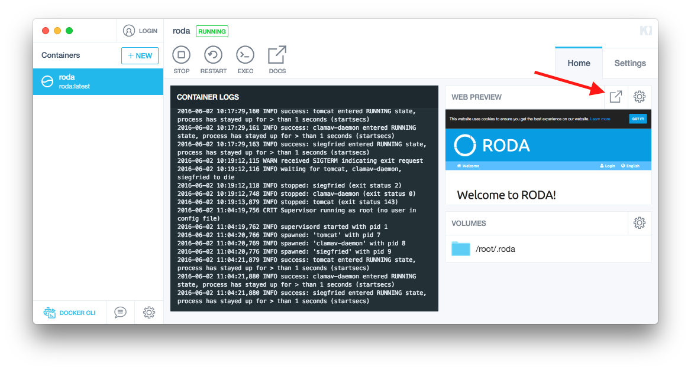

# Installation in testing environments

This is the easiest way to install RODA. If you want to test drive the software, just follow these instructions based on your operating system. We support MacOS, Windows and Linux.

## MacOS and Windows

Just install [Kitematic](https://kitematic.com), and search for "roda". Install and run docker container. It's that easy.

Kitematic is like an AppStore that automates the Docker installation and setup process and provides an intuitive graphical user interface (GUI) for running Docker containers (i.e. lightweight Virtual Machines).




**NOTE**: The RODA docker container has some limitations on Windows due to filename incompatibilities. This means that your will be limited to the storage capacity within the container. If you change the default configuration to use the storage of the host machine it will not work.


## Linux

On Linux, follow these instructions:

1. Install docker for your system: https://docs.docker.com/engine/installation/
2. Pull or update to the latest roda container, on the command line run:  `sudo docker pull keeps/roda`
3. Run the container: `sudo docker run -p 8080:8080 -v ~/.roda:/root/.roda keeps/roda`
4. Access RODA on your browser: [http://localhost:8080](http://localhost:8080)

NOTE: the docker commands only need `sudo` if your user does not belong to the `docker` group.
   
NOTE 2: if one wants to run some cronjobs in RODA container, there're two possibilities. But before, lets create a cronjob file with the right permissions (chmod 644 ~/cronjob). In this example we are updating, at 2 am, siegfried signature file:

```
MAILTO=""
0 2 * * * root sf -update && pkill sf
```

And the two possibilities are:

Add cronjob file via docker copy (after starting the container)

```bash
$> docker cp ~/crontab CONTAINER_NAME:/etc/cron.d/crontab
```

Or run the container using the volume option (-v) to pass by the cronjob file - In this scenario, the cronjob file must be owned by root because RODA container user is root (besides file permissions mentioned above):

```bash
$> sudo chown root.root ~/crontab
$> docker run -p 8080:8080 -v ~/.roda:/root/.roda -v ~/crontab:/etc/cron.d/crontab keeps/roda
```

To start as a service you can install supervisord and create the file `/etc/supervisor/conf.d/roda.conf` with:

```
[program:roda]
command=docker run -p 8080:8080 -v /home/roda/:/root/.roda keeps/roda
directory=/tmp/
autostart=true
autorestart=true
startretries=3
stderr_logfile=/var/log/supervisor/roda.err.log
stdout_logfile=/var/log/supervisor/roda.out.log
user=roda
```

These are the steps to start `supervisord`:

1. Create user 'roda': `sudo adduser roda`
2. Add user 'roda' to 'docker' group: `sudo usermod -aG docker roda`
3. Then restart supervisord (`sudo service supervisord restart`)
