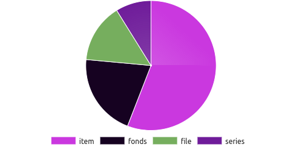
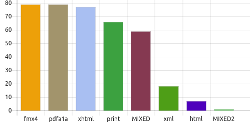
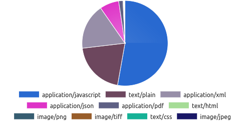
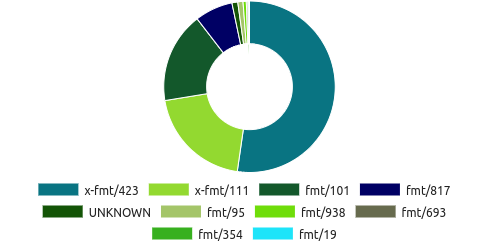
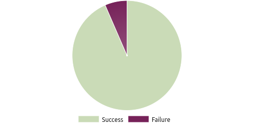
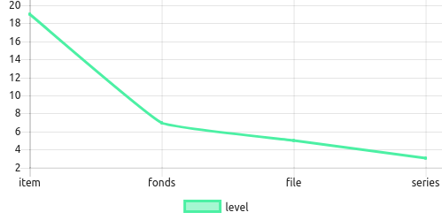
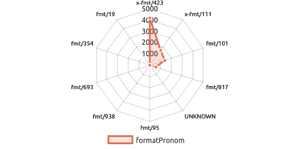
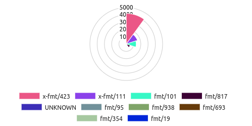
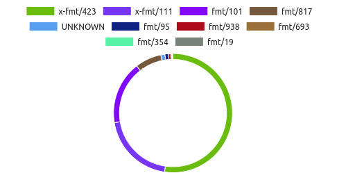
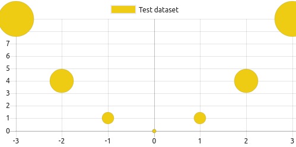

# Configurar novas estatisticas

Esta página fornece informações sobre como configurar novas estatísticas com base nas informações disponíveis no repositório. É importante saber que, para entender esta informação, é preciso ser-se um utilizador avançado com conhecimento de HTML, CSS e Javascript.

As estatísticas trabalham enviando pedidos ao RODA por meio da sua API (inspecionar a documentação da API para obter mais informações), coletando os resultados e apresentando-os como gráficos. Todo o processo é feito no lado do cliente por Javascript.

As secções a seguir fornecem trechos de código que podem ser usados ​​para exibir estatísticas sobre o estado do repositório. É só preciso incluir os snippets de código numa nova página HTML e o mecanismo de Javascript incluído irá lidar com toda a comunicação, carga de trabalho e apresentação. Novos gráficos e estatísticas podem ser criados alterando os parâmetros do pedido "data" incluídos nos snippets (e.g. data-source-filters).

## Índice AIP

**No. total de registos descritivos**

```html
<span class="statistic"
  data-source="index"
  data-source-class="org.roda.core.data.v2.ip.IndexedAIP"
  data-view="text"
  data-view-field="totalCount"></span>
```

**No. total de fundos**

```html
<span class="statistic"
  data-source="index"
  data-source-class="org.roda.core.data.v2.ip.IndexedAIP"
  data-source-filters="level=fonds"
  data-view="text"
  data-view-field="totalCount"></span>
```

**Distribuição dos níveis descritivos**



```html
<canvas class="statistic"
        data-source="index"
        data-source-class="org.roda.core.data.v2.ip.IndexedAIP"
        data-source-facets="level"
        data-view="chart"
        data-view-limit="10"
        data-view-field="facetResults"
        data-view-type="pie"></canvas>
```

## Índice de representações

**No. total de representações**

```html
<span class="statistic"
  data-source="index"
  data-source-class="org.roda.core.data.v2.ip.IndexedRepresentation"
  data-view="text"
  data-view-field="totalCount"></span>
```

**Distribuição dos tipos de representações**



```html
<canvas class="statistic"
        data-source="index"
        data-source-class="org.roda.core.data.v2.ip.IndexedRepresentation"
        data-source-facets="type"
        data-view="chart"
        data-view-limit="10"
        data-view-field="facetResults"
        data-view-type="bar"></canvas>
```

## Índice de ficheiros

**No. total de ficheiros**

```html
<span class="statistic"
  data-source="index"
  data-source-class="org.roda.core.data.v2.ip.IndexedFile"
  data-view="text"
  data-view-field="totalCount"></span>
```

**Distribuição de mimetypes**



```html
<canvas class="statistic"
        data-source="index"
        data-source-class="org.roda.core.data.v2.ip.IndexedFile"
        data-source-facets="formatMimetype"
        data-view="chart"
        data-view-limit="10"
        data-view-field="facetResults"
        data-view-type="pie"></canvas>
```

**Distribuição de PRONOM IDs**



```html
<canvas class="statistic"
        data-source="index"
        data-source-class="org.roda.core.data.v2.ip.IndexedFile"
        data-source-facets="formatPronom"
        data-view="chart"
        data-view-limit="10"
        data-view-field="facetResults"
        data-view-type="doughnut"></canvas>
```

## Índice de processos

**No. total de processos de ingestão**

```html
<span class="statistic"
  data-source="index"
  data-source-class="org.roda.core.data.v2.jobs.Job"
  data-source-filters="pluginType=INGEST, state=COMPLETED"
  data-source-facets="pluginType"
  data-view="text"
  data-view-field="totalCount"></span>
```

## Índice de registos

**No. total de logins**

```html
<span class="statistic"
  data-source="index"
  data-source-class="org.roda.core.data.v2.log.LogEntry"
  data-source-filters="actionComponent=org.roda.wui.api.controllers.UserLogin, actionMethod=login, state=SUCCESS"
  data-view="text"
  data-view-field="totalCount"></span>
```

**No. total de logins falhados**

```html
<span class="statistic"
  data-source="index"
  data-source-class="org.roda.core.data.v2.log.LogEntry"
  data-source-filters="actionComponent=org.roda.wui.api.controllers.UserLogin, actionMethod=login, state=FAILURE"
  data-view="text"
  data-view-field="totalCount"></span>
```

**Login com sucesso vs falhados**



```html
<canvas class="statistic"
        data-source="index"
        data-source-class="org.roda.core.data.v2.log.LogEntry"
        data-source-filters="actionComponent=org.roda.wui.api.controllers.UserLogin, actionMethod=login"
        data-source-facets="state"
        data-view="chart"
        data-view-limit="10"
        data-view-field="facetResults"
        data-view-type="pie"></canvas>
```

## Outros gráficos

### Gráficos de linhas

**Distribuição de nivel descritivos**



```html
<canvas class="statistic"
        data-source="index"
        data-source-class="org.roda.core.data.v2.ip.IndexedAIP"
        data-source-facets="level"
        data-view="chart"
        data-view-limit="10"
        data-view-field="facetResults"
        data-view-type="line"></canvas>
```

### Gráficos de radar

**Distribuição de formatos PRONOM**



```html
<canvas class="statistic"
        data-source="index"
        data-source-class="org.roda.core.data.v2.ip.IndexedFile"
        data-source-facets="formatPronom"
        data-view="chart"
        data-view-limit="10"
        data-view-field="facetResults"
        data-view-type="radar"></canvas>
```

### Gráficos polares

**Distribuição de formatos PRONOM**



```html
<canvas class="statistic"
        data-source="index"
        data-source-class="org.roda.core.data.v2.ip.IndexedFile"
        data-source-facets="formatPronom"
        data-view="chart"
        data-view-limit="10"
        data-view-field="facetResults"
        data-view-type="polarArea"></canvas>
```

### Função personalizada para manipular dados de facetas

**Distribuição de formatos PRONOM**



```html
<canvas class="statistic"
        data-source="index"
        data-source-class="org.roda.core.data.v2.ip.IndexedFile"
        data-source-facets="formatPronom"
        data-view="chart"
        data-view-limit="10"
        data-view-field="facetResults"
        data-view-type="function"
        data-view-type-function="facetCustomDataHandlerChartOptions"></canvas>
<script type="text/javascript">
    function facetCustomDataHandlerChartOptions(data, element){
        var options = {};
        var facet = data.facetResults.length > 0 ? data.facetResults[0] : null;
        if (facet) {
            options = {
                type: "pie",
                data: {
                    labels: facet.values.map(function (value) {
                        return value.label;
                    }),
                    datasets: [{
                        label: facet.field,
                        data: facet.values.map(function (value) {
                            return value.count;
                        }),
                        backgroundColor: facet.values.map(function () {
                            return rgbaRandomOpaqueColorAsString();
                        })
                    }]
                },
                options: {
                    cutoutPercentage: 90
                }
            };
        }
        return options;
    }
</script>
```

### Função personalizada para criar gráfico

**Gráfico de bolhas**



```html
<canvas class="statistic"
        data-source="function"
        data-function="customDataBubbleChart"></canvas>
<script type="text/javascript">
    function customDataBubbleChart(element) {
        new Chart(element, {
            type: 'bubble',
            data: {
                datasets: [{
                    label: "Test dataset",
                    data: [-3,-2,-1,0,1,2,3].map(function (value) {
                        return {
                            x: value,
                            y: value * value,
                            r: Math.abs(value) * 10
                        };
                    }),
                    backgroundColor: rgbaRandomOpaqueColorAsString(),
                    hoverBackgroundColor: rgbaRandomOpaqueColorAsString()
                }]
            }
        });
    }
</script>
```
